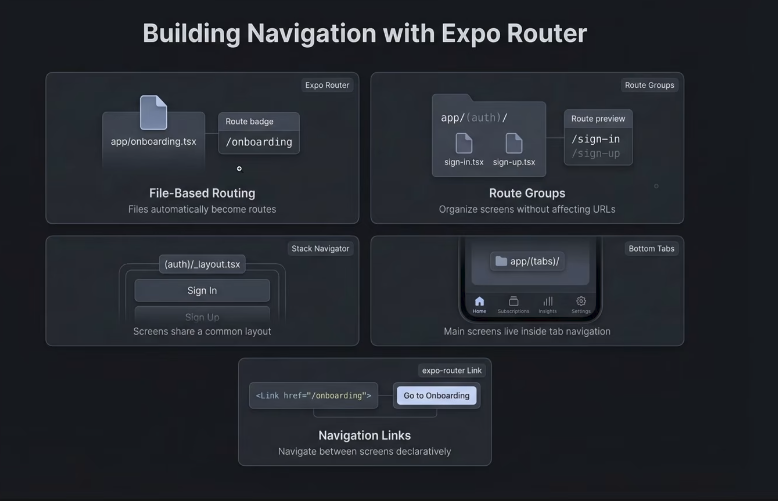
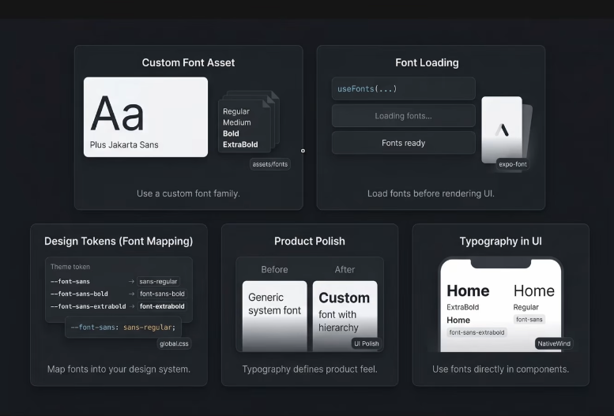

# Welcome to your Expo app

This is an [Expo](https://expo.dev) project created with [`create-expo-app`](https://www.npmjs.com/package/create-expo-app).

## Get started

1. Install dependencies

   ```bash
   npm install
   ```

2. Add the ngrok:
   ```bash
   npx ngrok config add-authtoken YOUR_TOKEN
   ```   
3. Start the app

   ```bash
   npx expo start --tunnel -c

   ```

## Get a fresh project


```bash
npm run reset-project
```

### Tailwind:

## check this below link:
- https://www.nativewind.dev/v5/getting-started/installation


### expo-router:



### expo-fonts:

